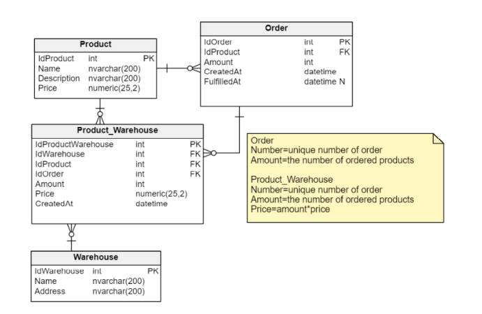

# Ćwiczenia 6



W trakcie tego samouczka ponownie użyjemy klas SqlConnection i SqlCommand. Tym razem logika interakcji z
naszą bazą danych będzie nieco bardziej skomplikowana. Tworzymy aplikację dla firmy zarządzającej
magazynem. Poniżej przedstawiono bazę danych, której używamy. Ponadto, w pliku create.sql znajdziesz skrypt,
który tworzy tabele i wypełnia je danymi.

## Zadanie 1
Utwórz WarehouseController i punkt końcowy, który będzie akceptować dane w następującym formacie.

```
{
	"IdProduct": 1,
	"IdWarehouse": 2,
	"Amount": 20,
	"CreatedAt": "2012-04-23T18:25:43.511Z"
}
```

### Główny scenariusz:

1. Sprawdzamy, czy produkt o podanym identyfikatorze istnieje. Następnie sprawdzamy, czy magazyn o podanym identyfikatorze istnieje. Wartość ilości przekazana w żądaniu powinna być większa niż 0.
1. Możemy dodać produkt do magazynu tylko wtedy, gdy istnieje zamówienie zakupu produktu w tabeli Order. 
Dlatego sprawdzamy, czy w tabeli Order istnieje rekord z IdProduktu i Ilością (Amount), które odpowiadają naszemu żądaniu. 
Data utworzenia zamówienia powinna być wcześniejsza niż data utworzenia w żądaniu.
1. Sprawdzamy, czy to zamówienie zostało przypadkiem zrealizowane. Sprawdzamy, czy nie ma wiersza z danym IdOrder w tabeli Product_Warehouse
1. Aktualizujemy kolumnę FullfilledAt zamówienia na aktualną datę i godzinę. (UPDATE)
1.  Wstawiamy rekord do tabeli Product_Warehouse. Kolumna Price powinna odpowiadać cenie produktu 
pomnożonej przez kolumnę Amount z naszego zamówienia. Ponadto wstawiamy wartość CreatedAt zgodnie z aktualnym czasem. (INSERT)
1. W wyniku operacji zwracamy wartość klucza głównego wygenerowanego dla rekordu wstawionego do tabeli Product_Warehouse.


Wszystkie pola są wymagane. Następnie zaimplementuj następujący scenariusz.

## Zadanie 2

Następnie dodaj drugi punkt końcowy do WarehouseController i spróbuj zaimplementować tę samą logikę za pomocą procedury składowanej. 
W pliku proc.sql znajdziesz procedurę składowaną przygotowaną przez administratora bazy danych. 
Sprawdź pracę administratora bazy danych i upewnij się, że procedura składowana jest poprawna (może zawierać błędy). 
Następnie wykonaj ją z twojego punktu końcowego.

Pamiętaj, że w przypadku jakiegokolwiek błędu zwróć odpowiedni kod HTTP.

# Komentarz

Dokonałem kilku drobnych zmian, mam nadzieję że nie będzie to duży problem.
Zamiast łączenia z bazą uczelni, używam bazy LocalDb .


## 4me
W razie problemów lokalną bazą.

1. View -> SQL Server Object Explorer -> Usuń LocalDb
1. Dodaj migrację (jeśli nie ma jej jeszcze): w PowerShell `dotnet ef migrations add InitialCreate`
1. Zaktualizuj bazę danych na podstawie migracji: w PowerShell `dotnet ef database update`
1.  Uruchom skrypt SQL: w Package Manager Console `Invoke-Sqlcmd -ServerInstance "(localdb)\mssqllocaldb" -Database "LocalDb" -InputFile "Scripts\create.sql"`